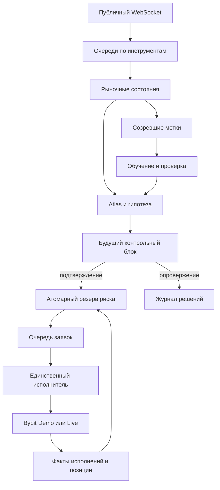

# Capitalizator + Atlas + контракты реакции

Эта ветка содержит исполняемое ядро `capitalizator.fusion` для Bybit USDT perpetual,
с двумя пользовательскими режимами: **Bybit Demo** и **Bybit Live**. Переключение
счёта не переключает торговую логику. Demo отправляет заявки в Demo API Bybit;
локальное воспроизведение ленты — отдельный инструмент проверки, не третий режим.

Ни 30% в месяц, ни 85% выигрышей, ни мировая уникальность не установлены. Написанный
алгоритм — проверяемая исследовательская гипотеза. Механические тесты не доказывают
рыночное преимущество. Ключи биржи, сервер пользователя и двухлетняя L2-история при
реализации не использовались; реальные заявки, включая Demo, не отправлялись.

## Запуск

Требуется Python **3.12+**, как в исходном Capitalizator. Совместимость с 3.10 не заявлена.

```bash
python3.12 -m venv .venv
.venv/bin/pip install -e '.[dev,live]'
.venv/bin/python -m capitalizator.fusion --userdir /srv/capitalizator/userdir/fusion
```

Консоль: `http://127.0.0.1:8082`. На удалённом сервере используйте SSH-туннель:

```bash
ssh -L 8082:127.0.0.1:8082 trader@SERVER
```

1. Выберите Bybit Demo. Нажмите «Пауза входов» и сохраните **ключ Demo Trading**.
   Это отдельный ключ отдельного Demo-счёта, не Testnet и не Live.
2. «Разрешить входы» разрешает алгоритму торговать при выполнении его условий.
   До подключения счёта продолжаются сбор данных и обучение без заявок.
3. **Ожидания суток BTC-ленты нет.** Первой модели нужны созревшие метки и достаточные
   train/calibration/test части; точное время зависит от реального потока данных.
   Старт сервиса не означает немедленную сделку.
4. Для Live отдельно сохраните Live-ключ, затем явно выберите Live. Проверяются
   результаты модели и Demo, отсутствие незавершённых ордеров и позиций текущего
   счёта, подключение целевого счёта. Автоперехода Demo → Live нет.

Ключи сохраняются в `<userdir>/secrets/demo.json` и `live.json` с правами 0600;
секреты не возвращаются через status. Альтернатива — переменные `CAP_DEMO_KEY`,
`CAP_DEMO_SECRET`, `CAP_LIVE_KEY`, `CAP_LIVE_SECRET`. Файлы имеют приоритет.
Ключам нужны разрешения чтения счёта и торговли. Используйте отдельный счёт,
USDT-маржу, односторонний режим позиций и единственный запущенный торговый сервис.

Полная конфигурация с начальными значениями: `infra/fusion.default.json`.
Скопируйте её в `<userdir>/config.json` либо передайте `--config PATH`.
Изменения конфигурации применяются после перезапуска и меняют её хеш; модель с
другим хешем не загружается как действующая. Журналы и архив необходимо сохранять.

```bash
.venv/bin/python -m capitalizator.fusion --userdir /srv/capitalizator/userdir/fusion --status
```

Основной `infra/deploy/compose.yml` запускает только fusion. Исходный многосервисный
стек сохранён в `compose.legacy.yml` для исследования. Перед миграцией остановите
старый signer и завершите его позиции; не запускайте оба стека на одном счёте.
Docker-конфигурация подготовлена, но контейнер и сервер пользователя здесь не развёрнуты.

## Что соединено

| Часть | Исполняемая роль |
|---|---|
| Capitalizator | Нормализация принтов, построение закрытых баров, BOS/OB/FVG, RSI-контекст, календарь и исследовательские модули |
| Atlas | Три условные модели реакции потока: продолжение, поглощение, нейтральная реакция; совместные сценарии цены, агрессии, пополнения и длительности |
| Контракт реакции | Зафиксированная гипотеза с одним будущим контрольным блоком, опровержением и сроком действия; деньги резервируются только после подтверждения |
| Исполнение | Собственный журнал фактов Bybit, атомарный резерв риска и долговечная очередь заявок; один поток меняет счёт |

Старые `first_fact`, бумажные исполнения и HYEXEC не выдаются за подтверждение новой
заявки. Они остаются отдельными исследовательскими реализациями. Atlas здесь —
условная статистическая модель наблюдаемого потока; она не идентифицирует кошельки
и не доказывает намерение манипулировать.



## Данные и признаки

Публичные потоки: `orderbook.50`, `publicTrade`, `tickers`, `allLiquidation`.
Raw public WebSocket сохраняет snapshot/delta без переписывания pybit.
REST backfill загружает только закрытые 1m/5m/15m/1h/4h; это контекст, не фиктивная лента.
Есть время биржи и время получения, дедупликация сделок, снимки стакана и новое
поколение данных после восстановления подключения. Переполнение очереди или
задержка обработки запрещают входы и инициируют восстановление снимка.

Основной вектор содержит 12 наблюдаемых величин: логарифмическое изменение цены,
долю агрессивного потока, дисбаланс видимой глубины, спред, подписанное пополнение,
изменение OI, ликвидации, положение в диапазоне, sweep, реализованную волатильность,
длительность и объём блока. Объёмы агрегируются по реальным принтам.

| Концепция | Реализация и границы интерпретации |
|---|---|
| AMD | Операционные метки диапазона, sweep/reclaim и направленного движения; не скрытая истина о действиях крупных игроков |
| Ликвидность | Предшествующие экстремумы и равные подтверждённые pivot-уровни; фактические пользовательские стопы недоступны |
| Обязательный sweep | Выход за предшествующий диапазон с возвратом; HTF POI и младший sweep/reclaim |
| HTF/LTF | Пары 15m→1m, 1h→5m, 4h→15m; отсутствие подтверждения запрещает вход |
| Delta/CVD/OI/ликвидации | Подписанные принты и изменения публичных данных, процентили объёма/OI; сторона ликвидации трактуется как сторона ликвидированной позиции |
| Volume Profile | Гистограмма реальных цен сделок, POC и смежная 70% Value Area; UTC-блоки и отдельные перекрывающиеся Tokyo/London/New York с DST |
| FVG/BAG | FVG исходного Capitalizator; BAG строго определён как двухбарный неперекрывающийся разрыв за старым диапазоном, а не любой импульс |
| BOS/CHoCH/OB | Закрытые бары, подтверждённые pivots, смена направления BOS и зона противоположной свечи |
| Premium/Discount/OTE | Входная половина 0.5–1 отката; OTE 0.618–0.786 отображается как контекст |
| ATR/тренд/фигуры/RSI | True Range, линии подтверждённых pivots, геометрия флага/треугольника, дивергенции RSI; не самостоятельный основной сигнал |
| Айсберг | Показатель пополнения против агрессии при слабой реакции цены; L2 без order IDs не позволяет доказать наличие айсберга |
| Gamma | Bybit option OI/Greeks/IV; unsigned gross gamma и изменения, концентрация страйков; IV может уменьшать риск. Dealer sign неизвестен |
| Новости | Bybit, официальные RSS/Atom по активам, словарный NLP, макрокалендарь и адаптер Tokenomist; индивидуальная свежесть/покрытие и первое получение |

Первый профиль сессии после запуска может быть частичным; это отмечено в данных.
Контекстные фигуры не суммируются как независимые «голоса» за сделку. Исторические
OHLCV не позволяют восстановить очередность L2, скрытые заявки или очереди исполнения.
Новости покрывают только подключённые источники, а не все события мира. Макрокалендарь
обновляет отдельный поток по официальным BLS/BEA/Fed. Ошибка источника, истечение
срока годности или отсутствие будущего события блокируют вход. Время получения
заголовка не заменяет расписание CPI/FOMC. Подробности ниже.

## Обучение и контракт

Блок закрывается при сочетании числа принтов и минимальной длительности либо при
достижении максимальной длительности. Модель учится и на тех наблюдениях, по которым
сделка не открывалась. Метка становится доступной только после окончания горизонта;
издержки фиксируются в момент исходного прогноза, а не берутся из будущего.

Обучение — ансамбль взвешенных ridge-моделей с мягкими весами режимов. Это регулярное
переобучение, не PPO/SAC. Оно выбрано для проверяемости на небольшом первоначальном
наборе. Разбиение 60/20/20 хронологическое; метки, пересекающие границы, исключаются.
Регуляризация выбирается на calibration; test не участвует в выборе ridge. Повторное
переобучение со скользящим окном не делает повторно используемый test независимым
навсегда — отдельный длительный период проверки полной стратегии всё равно нужен.

Совместные остатки формируют сценарии. Нижняя оценка преимущества:

`min(направленная средняя доходность трёх моделей) − ошибка оценки − издержки`.

Это консервативное правило принятия решения, а не доказательство вероятностного
покрытия при смене режима. Параметры режимных весов и сетка ridge — явные проектные
допущения; они не объявлены статистически оптимальными.

Контракт фиксирует символ, сторону, версию модели/конфигурации, исходные признаки,
уровень опровержения, структурную цель, ожидаемые будущие flow/refill и deadline.
Подтверждение использует **следующий** блок: направленный поток, пополнение и
сохранение цены. Пропущенный checkpoint нельзя заменить более удобным поздним.
Повторная проверка текущего блока не считается новым свидетельством.

Новый entry проверяет оставшееся преимущество, свежесть стакана/тикера/счёта/новостей,
новостное окно, RR и общий риск. Пауза повторно проверяется непосредственно перед
резервированием и перед сетевой отправкой. Позиция выходит при опровержении,
исчезновении преимущества удержания, структурной цели, лимите времени или дневном
лимите; отдельный стоп размещается на бирже. Трейлинг может только ужесточать стоп.

Смена версии политики исключает старые метки из обучения и начинает новую эпоху
Demo-квалификации. Возобновить изменённый Live без неё нельзя.
Live дополнительно требует прошедший модельный test, минимум 32 завершённых Demo
эпизода, положительный net и положительную нижнюю оценку moving-block bootstrap.
Для квалификации учитываются эпизоды со входом текущей политики; ручные входы
не засчитываются. Смешанная и неполная история позиции блокирует такой допуск. Эти проверки
снижают вероятность очевидного ошибочного допуска, но не сертифицируют доходность.

## Риск и конкуренция

Размер позиции ограничен одновременно бюджетом сделки, оставшимся дневным бюджетом,
общим портфельным риском, общей маржей, участием в видимой глубине и лимитами биржи.
Округление вниз выполняется через Decimal; минимальный лот не поднимает риск выше
разрешённого. Позиции и незавершённые заявки одного символа не допускают пирамидинг.
Портфель считается полностью связанным: скидки за мнимую диверсификацию отсутствуют.

Стоп располагается за экстремумом sweep и границей HTF POI с отступом не меньше
ATR, хвоста прогнозного распределения и спреда. RR проверяется после издержек. Это не делает его «невидимым» и не гарантирует цену исполнения.
До входа проверяется консервативная дистанция маржи, после исполнения — фактический
стоп и liquidation price Bybit. Неподтверждённый стоп приводит к запросу закрытия.

| Механизм | Инвариант |
|---|---|
| Владелец состояния инструмента | Один рыночный поток меняет конкретный Market |
| Очереди | FIFO внутри инструмента, round robin между инструментами, конечная ёмкость и явное переполнение |
| SQLite WAL + FIFO-lock | Резерв риска и запись заявки находятся в одной транзакции |
| Поток исполнителя | REST-изменения счёта не выполняются из UI, обучения или рыночных потоков |
| Команда паузы | Подтверждается после уже начатой отправки; после подтверждения новая отправка запрещена |
| execId | Уникальность по `(mode, execId)` переживает перезапуск |
| Неизвестный результат | Заявка сохраняет резерв и прежний ID; пустой lookup не означает доказанный отказ |
| Частичное исполнение | Закрывается фактический размер позиции из ответа Bybit |
| Остановка | Закрываются очереди, присоединяются потоки, выполняется отмена новых входов; защитные стопы остаются на бирже |
| Архив | fsync → rename → манифест → удаление непрерывного префикса журнала; контрольная сумма при чтении |

Рыночные потоки, исполнитель, координатор обучения, архив, новости (пул до четырёх источников),
макрокалендарь (три источника), исторические свечи, опционы и обслуживание работают раздельно. Admission-lock
не удерживается во время сетевой отправки. Брокер пробуждается по событию. NumPy выполняет математику в нативном коде; наличие Python-потоков не
обещает линейного ускорения CPU из-за GIL. Обучение выполняет отдельный spawn-процесс
с одним потоком BLAS и пониженным CPU-приоритетом; одновременно передаётся одна
задача. Координатор публикует только полностью полученную модель. При остановке
незавершённое обучение прерывается, биржевая outbox остаётся в основном процессе.
В Docker число потоков BLAS также ограничено для основного процесса.
Тесты проверяют конкретные гонки и отсутствие голодания в используемых очередях,
но не являются формальным доказательством отсутствия любых гонок ОС/SDK/биржи.

Если биржа надолго теряет факт заявки, система удерживает неопределённый резерв и
останавливает новые действия по нему. Она не «исправляет» это вымышленным отказом.
При недоступности сети локальное закрытие невозможно; действуют биржевые стопы.
Кнопка «Закрыть позиции» означает запрос, а не немедленно подтверждённый flat.

## Значения по умолчанию и их смысл

| Группа | Значения | Основание |
|---|---|---|
| Риск | 0.25% сделка, 1% портфель, 2% день | Консервативные ограничения капитала, не найденный исторический оптимум |
| Маржа | 20% equity, плечо не выше 2, максимум 2 позиции | Ограничение совокупной нагрузки на счёт |
| Исполнение | 1% видимой глубины, спред до 10 bps, TTL 10 с | Начальные ограничения участия и потери актуальности цены |
| Блоки | 64 принта, 5–30 с, контекст 32, горизонт 4 | Предварительный горизонт микроструктурной гипотезы; требует проверки чувствительности |
| Обучение | Demo от 64 меток; Live от 512; окно 8192; обновление через 64 | Вычислительный бюджет и минимальная доступность частей выборки, не гарантия достаточности |
| Свежесть | Стакан 5 с, счёт/тикер 15 с, модель 1 ч, новости 180 с | Максимальные операционные сроки годности |
| Контроль | Один следующий блок, deadline 120 с, удержание до 900 с, RR ≥2 | Не допускает произвольного продления проверки и удержания |
| Новости | 15 минут до/после | Настраиваемая операционная политика окна |
| Инфраструктура | 2 market worker, очередь 4096, квант 32, архив 10000 событий | Ограничение памяти и доли обслуживания одного инструмента |
| Остальные константы | 70% VA, RSI/ATR 14, pivots 2, ridge 0.1/1/10/100, 1000 bootstrap | Явные определения контекста и вычислительный бюджет; не заявляются оптимальными |

Demo-комиссии предварительно заданы как maker 0.0002 и taker 0.00055: endpoint
персональных комиссий не входит в опубликованный список Demo API. Измените оценку
под свои условия. В журнале P&L используются полученные `execFee`, а не эта оценка.
В Live ставки читаются через API. Отдельные фиксированные страховые отступы проверки
маржи и риска открытой позиции — консервативная политика, не модель ликвидации Bybit.

## Воспроизведение и проверки

Актуальный [аудит причин и интеграций](docs/FUSION-CAUSAL-AUDIT-2026-09-06.md)
содержит воспроизведённые дефекты, результаты тестов и ограничения. Результаты
предыдущего аудита сохранены в его отдельном историческом отчёте.

```bash
.venv/bin/pytest
.venv/bin/ruff check src tests
.venv/bin/mypy
.venv/bin/mypy --follow-imports=silent src/capitalizator/fusion
.venv/bin/python -m capitalizator.fusion.replay \
  --userdir /srv/capitalizator/userdir/fusion \
  --output /srv/capitalizator/replay/run-001 --latency 0.2
```

Остановите запись либо работайте с согласованной копией базы и архива. Выходной
каталог должен быть новым, чтобы обученное состояние предыдущего прогона не попало
в новый test. Метаданные инструментов берутся из Demo-подключения или JSON-файла
через `--instruments`; конфигурация задаётся тем же `--config`, что при записи.

`comparison.json` содержит четыре варианта:

- A: явная базовая логика sweep/зона с контекстом Capitalizator; **не полный старый DeskLoop**.
- B: A с будущим контрактом реакции.
- C: Atlas без контрольного блока.
- D: Atlas с контрольным блоком и общими для всех вариантами риска/исполнения.

Воспроизведение моделирует задержку прихода заявки и отмены, PostOnly при приходе,
очередь перед лимитной заявкой, частичные исполнения, проход по видимой глубине для
выхода, MarkPrice-стопы, комиссии и funding. Выводит equity, закрытые эпизоды, Win
Rate, Profit Factor, дневной Sharpe и Maximum Drawdown с капитализацией. Нет позиции
в истории — нет придуманной прибыльной сделки. При нехватке данных метрика `null`.

Ограничения симулятора: собственное влияние на рынок не воспроизводится, точная
очередь скрытых/RPI-заявок неизвестна, совпавшие времена неоднозначны, входные данные
могут быть неполными. Небольшой ордер в видимой книге — модель исполнения, не биржа.
Порядок воспроизведения — долговечный порядок записи акторов; реальные гонки прихода
между инструментами не превращаются в идеальную синхронную историческую картину.

Двухлетний walk-forward, сравнение полной стратегии с полноценными Buy & Hold/MA
и доказательство преимущества здесь **не проведены**: подходящей истории L2 и
проверенных исполнений нет. `buy_hold_mean` в отчёте обучения — модельная контрольная
метрика горизонта, не доходность инвестиционного портфеля Buy & Hold. A/B/C/D —
разложение вклада механизмов, не доказательство превосходства над всем рынком.

Для рыночной приёмки нужны запись фактических Demo-исполнений, сверка комиссий и
stop/cancel/fill событий с Bybit, отдельные нетронутые временные интервалы, стресс
задержек/издержек и оценка стабильности на разных режимах рынка. Demo-исполнения
нельзя считать точным прогнозом реального исполнения и ёмкости стратегии.

## Документация протокола

- [Bybit Demo: отдельный счёт, API и ограничения](https://bybit-exchange.github.io/docs/v5/demo)
- [Создание ордера: асинхронное подтверждение и PostOnly](https://bybit-exchange.github.io/docs/v5/order/create-order)
- [Приватные исполнения](https://bybit-exchange.github.io/docs/v5/websocket/private/execution)
- [Публичный стакан](https://bybit-exchange.github.io/docs/v5/websocket/public/orderbook)
- [Ликвидации и сторона позиции](https://bybit-exchange.github.io/docs/v5/websocket/public/all-liquidation)

Совместимость адаптера проверяется по текущей документации и тестам на SDK, но
авторизованный интеграционный прогон Bybit остаётся отдельной проверкой перед использованием.

## Интерфейс, новости и резервная копия

График получает SSE (по умолчанию 200 мс) отдельно от статистики счёта. Есть свечи,
Volume/CVD, FVG/BAG/OB, уровни/OTE, профиль сессии, гипотезы и фактические исполнения.
Старые свечи повторно не передаются без изменения ревизии. Формирующаяся свеча —
только визуализация; в структуру входят закрытые. Вкладки новостей показывают
источники, время, покрытие и пробелы. Настройка источников описана в отчёте проверки.
Неполный начальный профиль не используется как цель POC.

```bash
python -m capitalizator.fusion.backup --userdir /absolute/path/to/fusion \
  --dest /absolute/path/to/new-backup
```

Backup сохраняет согласованный SQLite и только указанные в нём immutable-архивы,
конфигурацию и SHA256-манифест. Ключи не копируются. Для восстановления остановите
сервис, восстановите снимок в отдельный каталог и введите ключи заново. Биржевой
reconcile остаётся обязательным: восстановление БД не откатывает состояние биржи.


## Автоматическое расписание и актуальные позиции

`macro_poll_s=3600` — почасовое обновление опубликованных расписаний;
`macro_stale_s=86400` — максимальный возраст успешного расписания. Это бюджеты
поставщиков календаря, а не задержка котировок. Ошибка последней загрузки уже
блокирует покрытие; 24 часа не являются разрешением игнорировать ошибку.

- CPI/NFP: официальный iCalendar BLS, время и timezone берутся из DTSTART.
- PCE: официальный iCalendar BEA, событие Personal Income and Outlays.
- FOMC: опубликованная конечная дата заседания Fed и стандартное время решения
  14:00 New York; отдельное окно пресс-конференции 14:30. Для этих двух времён
  используется явно названная календарная конвенция, не результат чтения часа
  из годовой страницы. Внеплановое решение должно поступать через новости.
- Даты без времени и неподдержанные повторяющиеся ICS-события отклоняются.
  Переходы DST определяются IANA. known_at — первое получение системой.
- Обновлённое официальное расписание заменяет статические строки того же класса.
  CSV остаётся дополнительным контекстом, но не подменяет проверку доступности
  автоматических источников. При изменении HTML/ICS входы блокируются.

Анлоки и supply context теперь сохраняют тип при объединении календаря; их
не фильтрует повторно старый словарь новостей. Для монеты отдельно требуются RSS
и, кроме BTC/ETH, источник анлоков. Срочная новость становится доступна после
обработки её источника, не ожидая окончания всех остальных запросов.
Один и тот же обработчик news→flatten используется брокером и replay.

Приватные position-сообщения обновляют отображаемую позицию и биржевой стоп без
ожидания следующего REST-опроса. Они не обновляют возраст кошелька. Более старые
позиционные данные не откатывают уже полученное значение. График отображает
SL venue и отдельно плановый SL до появления позиции; сессии учитываются внутри
старших свечей, трендовые линии и RSI-дивергенции нанесены на цену.

Повтор отмены после запроса ограничен `reconcile_s`, сохраняется в БД и переживает
перезапуск. Команды обслуживаются по времени последней попытки; ошибка одного
символа не отменяет обслуживание остальных команд уже выбранной партии.
Несколько причин закрытия объединяются в одно незавершённое намерение закрыть
позицию. Пока оно не разрешено, новый вход по символу запрещён.
